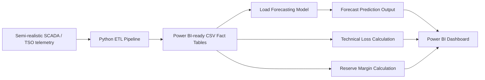

# TSO Operational Adequacy & Grid Analytics Platform

A portfolio-ready **Power BI + Python** project for Transmission System Operator (TSO), utility, SCADA and energy analytics roles.

This project simulates how a TSO could monitor:

- short-term load forecasting
- generation reserve margin
- technical transmission losses
- generation mix
- imports / exports
- outage events
- data quality issues

The goal is to show both **power-system domain understanding** and **practical data engineering / BI skills**.

---

## Project Positioning

This is not a generic sales dashboard.

It is designed as an **operational analytics dashboard** for grid control, planning and reliability teams.

Relevant roles:

- TSO Data Analyst
- Power System Data Engineer
- SCADA / EMS Analytics Engineer
- Energy Consultant
- Utility BI Engineer
- Operational Analytics Engineer
- Grid Reliability Analyst

---

## Architecture



### Data Pipeline

1. Generate or load semi-realistic hourly TSO data.
2. Clean and transform it using Python.
3. Calculate operational KPIs.
4. Train a load forecasting model.
5. Export Power BI-ready CSV tables.
6. Build an interactive dashboard in Power BI.

---

## Data Description

The data is **synthetic / semi-realistic**, not official grid data.

It was designed to mimic realistic TSO operational behavior:

- hourly load profile
- daily and seasonal demand variation
- temperature-driven load changes
- weekend and holiday effects
- day-ahead forecast error
- generation availability
- solar and wind variability
- imports and exports
- forced generation derating events
- reserve margin stress
- technical transmission losses by zone

This makes the project safe to publish on GitHub while still showing realistic analytics logic.

---

## Main Datasets

| File | Description |
|---|---|
| `fact_tso_hourly.csv` | Main hourly operations table with load, forecast, generation, imports, exports, losses and reserve margin. |
| `fact_zone_losses.csv` | Zone-level injected energy, delivered load and technical losses. |
| `fact_load_forecast_predictions.csv` | Model predictions with forecast errors. |
| `fact_outages.csv` | Simulated forced generation derating events. |
| `dim_generation_fleet.csv` | Generation fleet metadata. |
| `daily_summary_powerbi.csv` | Daily summary table for faster visuals. |
| `model_metrics.csv` | Forecasting model performance metrics. |

---

## Key KPIs

| KPI | Formula / Logic |
|---|---|
| Peak Load MW | `MAX(actual_load_mw)` |
| Forecast MAPE % | `AVG(|Actual - Forecast| / Actual) × 100` |
| Technical Loss MWh | `Generation + Imports - Exports - Delivered Load` |
| Technical Loss % | `Technical Loss MWh / Injected Energy × 100` |
| Reserve MW | `Available Generation + Imports - Forecast Load - Exports` |
| Reserve Margin % | `Reserve MW / Forecast Load × 100` |
| Shortage Risk Hours | Count of hours where reserve margin is below threshold |
| Renewable Share % | `(Solar + Wind) / Total Generation × 100` |
| Import Dependency % | `Imports / (Generation + Imports) × 100` |

---

## Dashboard Pages

### 1. Executive Operations Overview

Main control-room view with:

- Peak Load MW
- Forecast MAPE %
- Technical Loss %
- Reserve Margin %
- Shortage Risk Hours
- Renewable Share %
- Import Dependency %

Recommended visuals:

- Actual load vs forecast load
- generation mix
- reserve margin gauge
- technical losses by zone
- high-risk operating hours table

---

### 2. Load Forecasting

Shows:

- actual load vs day-ahead forecast
- actual load vs model prediction
- forecast error by hour
- model MAE / MAPE / R²
- temperature vs load relationship

---

### 3. Technical Loss Analytics

Shows:

- technical loss trend
- loss percentage by zone
- injected energy vs delivered load
- hourly/zone loss heatmap

---

### 4. Reserve & Adequacy

Shows:

- reserve margin over time
- available generation vs forecast load
- shortage-risk hours
- outage events
- import/export dependency

---

### 5. Data Quality

Shows:

- missing timestamp checks
- null values
- outliers
- high forecast-error hours

---

## Core Formulas

### Technical Losses

```text
Technical Losses = Total Generation + Imports - Exports - Delivered Load
```

```text
Technical Loss % = Technical Losses / (Total Generation + Imports) × 100
```

### Reserve Margin

```text
Reserve MW = Available Generation + Imports - Forecasted Load - Exports
```

```text
Reserve Margin % = Reserve MW / Forecasted Load × 100
```

### Forecast Error

```text
Forecast Error = Actual Load - Forecast Load
```

```text
MAPE = Average(|Actual - Forecast| / Actual) × 100
```

---

## Repository Structure

```text
tso-load-loss-reserve-dashboard/
│
├── data/
│   ├── raw/
│   └── processed/
│
├── docs/
│   ├── architecture.md
│   └── kpi_catalog.md
│
├── powerbi/
│   ├── dax_measures.txt
│   └── dashboard_layout.md
│
├── scripts/
│   ├── etl_pipeline.py
│   ├── train_forecast_model.py
│   └── generate_sample_data.py
│
├── screenshots/
│   ├── overview_load_forecast.png
│   ├── reserve_margin.png
│   └── technical_losses_by_zone.png
│
├── requirements.txt
└── README.md
```

---

## How to Run Locally

### 1. Clone the Repository

```bash
git clone https://github.com/YOUR_USERNAME/tso-load-loss-reserve-dashboard.git
cd tso-load-loss-reserve-dashboard
```

### 2. Create Python Environment

```bash
python -m venv .venv
source .venv/bin/activate
```

For Windows:

```bash
.venv\Scripts\activate
```

### 3. Install Dependencies

```bash
pip install -r requirements.txt
```

### 4. Run ETL

```bash
python scripts/etl_pipeline.py
```

### 5. Train Forecasting Model

```bash
python scripts/train_forecast_model.py
```

The outputs will be saved in:

```text
data/processed/
```

---

## How to Build the Power BI Dashboard

Open Power BI Desktop and import these CSV files:

```text
data/processed/fact_tso_hourly.csv
data/processed/fact_zone_losses.csv
data/processed/fact_load_forecast_predictions.csv
data/processed/fact_outages.csv
data/processed/dim_generation_fleet.csv
data/processed/model_metrics.csv
```

Then:

1. Add the DAX measures from `powerbi/dax_measures.txt`.
2. Use the layout guide in `powerbi/dashboard_layout.md`.
3. Build the dashboard pages:
   - Executive Overview
   - Load Forecasting
   - Technical Losses
   - Reserve & Adequacy
   - Data Quality
4. Export screenshots into the `screenshots/` folder.
5. Add the screenshots to this README.

---

## Suggested Power BI Relationships

For a simple portfolio version, you can build visuals directly from the imported tables.

For a cleaner model, create a Date/Time table and connect it to:

- `fact_tso_hourly[timestamp]`
- `fact_zone_losses[timestamp]`
- `fact_load_forecast_predictions[timestamp]`
- `fact_outages[timestamp]`

---

## Sample Dashboard Preview

### Load Forecast


### Reserve Margin


### Technical Losses by Zone


---

## Why This Project Is Strong

This project demonstrates:

- power system operations knowledge
- TSO adequacy and reserve concepts
- SCADA-style telemetry analytics
- Python ETL
- forecasting model development
- Power BI dashboard design
- operational KPI thinking
- data quality awareness

It is stronger than a generic BI dashboard because it connects analytics directly to grid operations and reliability.

---


